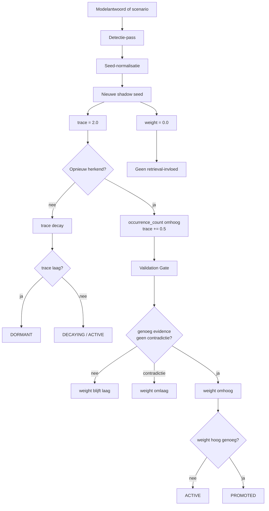

# Shadow Seed Learning 4.5

[](https://github.com/E-AI-MODEL/shadowseed/actions/workflows/tests.yml)


**Shadow Seed Learning (SSL) 4.5** is een research prototype voor het herkennen van kleine structurele afwezigheden in antwoorden. Zo'n afwezigheid wordt opgeslagen als een gewichtloze seed. Pas na validatie mag zo'n seed invloed krijgen op vervolgvragen, retrieval of falsificatie.

> Een seed bevat precies één gap.

De huidige repo draait nog als **SSL 4.5-harness**, maar de canonieke inhoudelijke bron voor het doelbeeld staat nu in:

```text
docs/00_shadow_seed_learning_4_6.md
```

Die `4.6`-bron beschrijft niet een nieuwe mechanische kern, maar een scherpere evaluatiekoers: minder leunen op scenario-afhankelijke suiteclaims, en meer sturen op open-set seedkwaliteit, adversarial Gate-evaluatie, probe utility en domeintransfer.

## Status in één oogopslag

- mechanische kern: huidige repo-implementatie en standaard regressieroutes
- canoniek doelbeeld: `docs/00_shadow_seed_learning_4_6.md`
- standaardpad voor contributors en CI: `pip install -e ".[test]"`
- research-verdieping: open-set review, adversarial Gate, probe utility, retrieval- en backendvergelijkingen

Praktisch betekent dit: de repo is coherent als benchmark-harness, maar niet elke research-route hoort al bij dezelfde stabiele basislaag als de standaard CI.

## Eerst lezen

Begin in deze volgorde:

```text
docs/00_shadow_seed_learning_4_6.md
docs/ARCHITECTURE_MAP.md
docs/research/current-status.md
docs/research/scenario-independence-roadmap.md
docs/research/evaluation-matrix.md
docs/research/next-phase-implementation.md
```

Die zes documenten samen beantwoorden:

- wat SSL inhoudelijk wil zijn;
- wat de repo vandaag werkelijk draait;
- wat de huidige standaardruns echt aantonen;
- welke claims nog te groot zouden zijn;
- hoe de repo inhoudelijk naar sterker bewijs moet migreren;
- welke concrete uitvoervolgorde nu de hoogste hefboom heeft.

Voor de bredere documentatiekaart:

```text
docs/README.md
```

Voor de commandostructuur:

```text
docs/CLI_COMMAND_MAP.md
```

## Installatie

```bash
pip install -e ".[test]"
```

Optioneel met echte model- of vectorbackends:

```bash
pip install -e ".[test,models,vector]"
```

Voor een bredere lokale research-omgeving kun je daarna extra profielen of losse optionele dependencies toevoegen, maar de standaard docs en CI gaan uit van de testinstallatie hierboven.

## Snel starten

```bash
pytest
shadowseed run-gap-suite
shadowseed run-false-positive-suite
shadowseed run-benefit-suite
shadowseed run-open-set-seed-review
shadowseed summarize-open-set-seed-review
shadowseed run-adversarial-gate-benchmark
shadowseed run-probe-utility-benchmark
shadowseed analyze-results
```

## Commandtiers

De CLI heeft nu bewust vier lagen:

- `standard`: regressie- en smoke-routes die horen bij de huidige meetketen
- `manual research`: open-set, adversarial en probe-verdieping
- `retrieval/backend`: diagnose- en backendroutes
- `absencebench`: utility- en voorbereidingsroutes

De volledige indeling staat in `docs/CLI_COMMAND_MAP.md`.

## Belangrijkste CLI-routes

| Commando | Gewone naam | Wat test het? |
|---|---|---|
| `shadowseed run-gap-suite` | Gap Finder | Vindt SSL bekende ontbrekende punten in de regressiesuite? |
| `shadowseed run-false-positive-suite` | Rustig blijven | Laat SSL volledige antwoorden met rust en blokkeert de Gate misleidende lure-seeds? |
| `shadowseed run-benefit-suite` | Antwoordwinst | Wordt een antwoord completer met SSL-toevoegingen? |
| `shadowseed run-open-set-seed-review` | Open-set review | Maakt seed-output en review-packets zonder vaste ground-truth seedlijst |
| `shadowseed summarize-open-set-seed-review` | Open-set samenvatting | Agregeert reviewer-uitkomsten naar acceptance, agreement en disagreement-artifacts |
| `shadowseed run-adversarial-gate-benchmark` | Adversarial Gate | Vergelijkt de huidige Gate met zwakkere promotieregels op misleidende lure-candidates |
| `shadowseed run-probe-utility-benchmark` | Probe utility | Laat zien of promoted seeds scherpere follow-up, retrieval en dialectische probes opleveren dan brede baselines? |
| `shadowseed run-model-benefit-suite --backend fixture` | Model smoke | Werkt de modelroute technisch zonder modeldownload? |
| `shadowseed run-blind-benchmark` | Blind test | Blijven labels verborgen tot de scoring? |
| `shadowseed run-retrieval-benchmark` | Retrieval check | Vindt de vectorstore de juiste bronstukken? |
| `shadowseed run-retrieval-model-benchmark` | Retrieval modelcheck | Helpt opgehaalde SSOT-context het modelantwoord? |
| `shadowseed run-ssot-smoke` | SSOT check | Werkt bronstatus en falsificatiebasis? |
| `shadowseed run-vectorstore-smoke` | Vectorstore check | Werkt opslag en zoeken in de gekozen backend? |
| `shadowseed analyze-results` | Rapport | Maakt Markdown, JSON en SVG-grafieken uit resultaten. |

## GitHub Actions in gewone taal

De standaardworkflow heet **Checks en benchmark-resultaten**. De runnamen zijn genummerd:

| Run | Betekenis |
|---|---|
| 01 Codecheck | Werkt de Python-code? |
| 02 Gap Finder | Regressiecheck voor bekende SSL-gaps |
| 03 Rustig blijven | Voegt SSL geen onzin toe? |
| 04 Antwoordwinst | Wordt een antwoord completer met SSL? |
| 05 Model smoke | Werkt de modeltest met fixture-backend? |
| 06 Blind test | Werkt de labelscheiding? |
| 07 Rapport | Vat de belangrijkste resultaten samen. |
| 08 AbsenceBench rooktest | Werkt de lokale dataset-run? |
| 09 Herhalingstest | Wat gebeurt er bij meer SSL-rondes? |

De open-set review, adversarial Gate-benchmark en probe utility suite zijn beschikbaar als handmatige benchmarklagen. Als resultaatbestanden aanwezig zijn, kan de repo ze apart meenemen of publiceren, zonder ze dezelfde status te geven als de standaard regressieruggengraat.

In stap **07 Rapport** worden de standaard-artifacts eerst provenance-safe verzameld: de originele artifactstructuur blijft bewaard in `results/artifacts/`, naamconflicten krijgen een artifactprefix en `results/manifest.json` legt vast waar elk analybestand vandaan komt.

Na een geslaagde push naar `main` publiceert **Publiceer testresultaten naar Wiki en Pages** de laatste artifacts naar Wiki en Pages. De workflow schrijft geen resultatensnapshot terug naar `main`. PR-runs worden niet gepubliceerd.

De publicatieroute faalt nu ook expliciet als een verwachte kernoutput ontbreekt, als `results/latest/manifest.json` leeg is of als `results/latest/summary.json` geen bruikbare JSON bevat. Daardoor zie je sneller het verschil tussen een echte publicatie en een stil halve run.

Handmatig opnieuw publiceren zonder nieuwe test-run kan via `workflow_dispatch` op **Publiceer testresultaten naar Wiki en Pages**. Die pakt de laatst geslaagde `push`-run op `main` en bouwt daar opnieuw de Wiki- en Pages-snapshot van.

## Resultaten

| Plek | Inhoud |
|---|---|
| workflow-artifact `published-latest-results-snapshot` | Platte snapshot van de gepubliceerde `results/latest` map |
| `results/latest/summary.json` | Centrale JSON-samenvatting binnen de gepubliceerde snapshot |
| `results/latest/analysis_report.md` | Leesbaar rapport binnen de gepubliceerde snapshot |
| `results/latest/manifest.json` | Herkomst van elk gepubliceerd artifact |
| `results/artifacts/` | Originele artifactstructuur uit GitHub Actions binnen de gepubliceerde snapshot |
| Wiki `Latest-Test-Results` | Startpunt voor gepubliceerde resultaten |
| GitHub Pages | Publiek dashboard |

## Architectuur



Belangrijk: `trace` en `weight` zijn gescheiden. Een seed kan zichtbaar zijn en toch niets sturen.

## Belangrijke bestanden

```text
src/shadowseed/manager.py                         # SSLManager: trace, weight, Validation Gate
src/shadowseed/benchmark/                         # alle benchmarkrunners
src/shadowseed/evaluation/README.md              # doelstructuur voor volgende bewijs-lagen
tests/                                            # regressie- en benchmarktests
src/shadowseed/data/                              # publieke testdata en sample-corpora
benchmarks/open_review/README.md                  # geplande open-set artifacts en datasets
benchmarks/adversarial/README.md                  # geplande Gate-comparison datasets
benchmarks/transfer/README.md                     # geplande domeintransfer-holdouts
docs/00_shadow_seed_learning_4_6.md              # canonieke bron voor theorie en doelbeeld
docs/ARCHITECTURE_MAP.md                          # repo-overzicht
docs/research/current-status.md                   # wat staat er vandaag echt?
docs/research/scenario-independence-roadmap.md    # route naar sterker bewijs
docs/research/evaluation-matrix.md                # welke laag draagt welke claim?
docs/research/next-phase-implementation.md        # concrete uitvoervolgorde vanaf de huidige harness
docs/wiki/Benchmarks.md                           # benchmarkuitleg
docs/CLI_COMMAND_MAP.md                           # indeling van commands en hun status
.github/workflows/tests.yml                       # standaard CI
.github/workflows/publish-test-results.yml        # publicatie naar Wiki en Pages
site/                                             # Pages-dashboard
```

## Huidige onderzoeksstatus

De repo is een research prototype. De huidige standaardruns laten zien dat de meetketen werkt: detectie, false-positive controle, antwoordwinst, model-smoke, blinde smoke-test, rapportage en publicatie.

De vaste scenario-suites moeten nu gelezen worden als regressie- en kleine benchmarklaag. Ze zijn nuttig om de kernmechaniek stabiel te houden, maar dragen niet zelfstandig de volledige algemene SSL-claim.

De handmatige open-set review, adversarial Gate-benchmark en probe utility suite zijn de eerste verdiepingslagen bovenop die regressieruggengraat. Ze maken de repo inhoudelijk eerlijker, maar zijn nog niet hetzelfde als brede eindvalidatie.

Dit is nog geen algemene claim dat SSL 4.5 altijd betere modelantwoorden oplevert. Daarvoor zijn grotere blinde suites, meerdere echte modellen, open-set seedbeoordeling, adversarial Gate-evaluatie, probe-evaluatie met menselijke review en menselijke beoordeling nodig.

## Wat dit niet claimt

- geen nieuw foundation model
- geen aanpassing van modelgewichten
- geen claim dat SSL state-of-the-art is
- geen bewijs buiten de huidige kleine suites
- geen verplichte LLM- of GPU-run voor de standaard CI
- geen automatische gelijkstelling van regressiesucces aan algemene validatie

## Documentatie

Lees verder in:

- `docs/README.md`
- `docs/00_shadow_seed_learning_4_6.md`
- `docs/ARCHITECTURE_MAP.md`
- `docs/CLI_COMMAND_MAP.md`
- `docs/research/current-status.md`
- `docs/research/scenario-independence-roadmap.md`
- `docs/research/evaluation-matrix.md`
- `docs/research/open-set-adversarial-plan.md`
- `docs/research/next-phase-implementation.md`
- `docs/wiki/Home.md`
- `docs/wiki/Benchmarks.md`
- `docs/wiki/Blind-Benchmark.md`
- `docs/results.md`

## Citeren

```text
Visser, H. (2026). Shadow Seed Learning 4.5: Atomische detectie en epistemische navigatie.
E-AI-MODEL/shadowseed.
```
