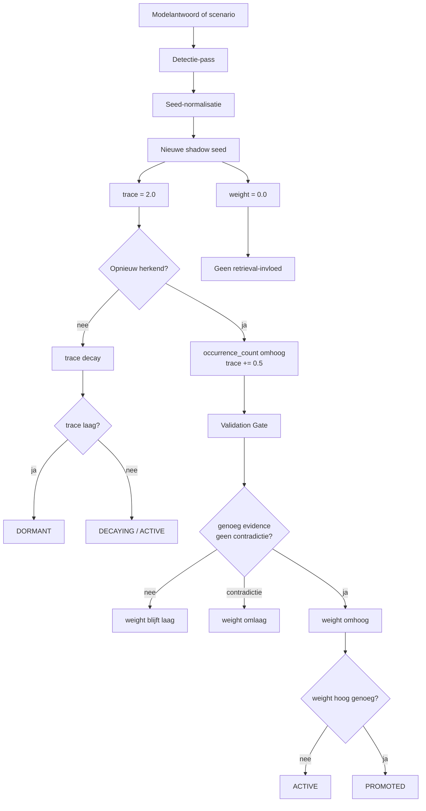

# Shadow Seed Learning 4.5

[](https://github.com/E-AI-MODEL/shadowseed/actions/workflows/tests.yml)


**Shadow Seed Learning (SSL) 4.5** is een research prototype voor het herkennen van kleine structurele afwezigheden in antwoorden. Zo'n afwezigheid wordt opgeslagen als een gewichtloze seed. Pas na validatie mag zo'n seed invloed krijgen op vervolgvragen, retrieval of falsificatie.

> Een seed bevat precies één gap.

## Eerst lezen

De repo is groter geworden dan één benchmark. Begin daarom hier:

```text
docs/ARCHITECTURE_MAP.md
```

Die pagina laat zien welke runs er zijn, wat ze doen en waar de resultaten staan.

## Installatie

```bash
pip install -e ".[test]"
```

Optioneel met echte model- of vectorbackends:

```bash
pip install -e ".[test,models,vector]"
```

## Snel starten

```bash
pytest
shadowseed run-gap-suite
shadowseed run-false-positive-suite
shadowseed run-benefit-suite
shadowseed analyze-results
```

## Belangrijkste CLI-routes

| Commando | Gewone naam | Wat test het? |
|---|---|---|
| `shadowseed run-gap-suite` | Gap Finder | Vindt SSL bekende ontbrekende punten? |
| `shadowseed run-false-positive-suite` | Rustig blijven | Laat SSL volledige antwoorden met rust? |
| `shadowseed run-benefit-suite` | Antwoordwinst | Wordt een antwoord completer met SSL-toevoegingen? |
| `shadowseed run-model-benefit-suite --backend fixture` | Model smoke | Werkt de modelroute technisch zonder modeldownload? |
| `shadowseed run-blind-benchmark` | Blind test | Blijven labels verborgen tot de scoring? |
| `shadowseed run-retrieval-benchmark` | Retrieval check | Vindt de vectorstore de juiste bronstukken? |
| `shadowseed run-retrieval-model-benchmark` | Retrieval modelcheck | Helpt opgehaalde SSOT-context het modelantwoord? |
| `shadowseed run-ssot-smoke` | SSOT check | Werkt bronstatus en falsificatiebasis? |
| `shadowseed run-vectorstore-smoke` | Vectorstore check | Werkt opslag en zoeken in de gekozen backend? |
| `shadowseed analyze-results` | Rapport | Maakt Markdown, JSON en SVG-grafieken uit resultaten. |

## GitHub Actions in gewone taal

De standaardworkflow heet **Checks en benchmark-resultaten**. De runnamen zijn genummerd:

| Run | Betekenis |
|---|---|
| 01 Codecheck | Werkt de Python-code? |
| 02 Gap Finder | Vindt SSL ontbrekende punten? |
| 03 Rustig blijven | Voegt SSL geen onzin toe? |
| 04 Antwoordwinst | Wordt een antwoord completer met SSL? |
| 05 Model smoke | Werkt de modeltest met fixture-backend? |
| 06 Blind test | Werkt de labelscheiding? |
| 07 Rapport | Vat de belangrijkste resultaten samen. |
| 08 AbsenceBench rooktest | Werkt de lokale dataset-run? |
| 09 Herhalingstest | Wat gebeurt er bij meer SSL-rondes? |

Na een geslaagde push naar `main` publiceert **Publish Test Results** de laatste artifacts naar Wiki en Pages. PR-runs worden niet gepubliceerd.

## Resultaten

| Plek | Inhoud |
|---|---|
| `results/latest/summary.json` | Centrale JSON-samenvatting voor dashboard en Wiki |
| `results/latest/analysis_report.md` | Leesbaar rapport |
| `results/latest/manifest.json` | Herkomst van elk gepubliceerd artifact |
| `results/artifacts/` | Originele artifactstructuur uit GitHub Actions |
| Wiki `Latest-Test-Results` | Startpunt voor gepubliceerde resultaten |
| GitHub Pages | Publiek dashboard |

## Architectuur



Belangrijk: `trace` en `weight` zijn gescheiden. Een seed kan zichtbaar zijn en toch niets sturen.

## Belangrijke bestanden

```text
src/shadowseed/manager.py                         # SSLManager: trace, weight, Validation Gate
src/shadowseed/benchmark/                         # alle benchmarkrunners
src/shadowseed/data/                              # publieke testdata
docs/ARCHITECTURE_MAP.md                          # repo-overzicht
docs/wiki/Benchmarks.md                           # benchmarkuitleg
.github/workflows/tests.yml                       # standaard CI
.github/workflows/publish-test-results.yml        # publicatie naar Wiki en Pages
site/                                             # Pages-dashboard
```

## Huidige onderzoeksstatus

De repo is een research prototype. De huidige standaardruns laten zien dat de meetketen werkt: detectie, false-positive controle, antwoordwinst, model-smoke, blinde smoke-test, rapportage en publicatie.

Dit is nog geen algemene claim dat SSL 4.5 altijd betere modelantwoorden oplevert. Daarvoor zijn grotere blinde suites, meerdere echte modellen en menselijke beoordeling nodig.

## Wat dit niet claimt

- geen nieuw foundation model
- geen aanpassing van modelgewichten
- geen claim dat SSL state-of-the-art is
- geen bewijs buiten de huidige kleine suites
- geen verplichte LLM- of GPU-run voor de standaard CI

## Documentatie

Lees verder in:

- `docs/ARCHITECTURE_MAP.md`
- `docs/README.md`
- `docs/wiki/Home.md`
- `docs/wiki/Benchmarks.md`
- `docs/wiki/Blind-Benchmark.md`
- `docs/results.md`

## Citeren

```text
Visser, H. (2026). Shadow Seed Learning 4.5: Atomische detectie en epistemische navigatie.
E-AI-MODEL/shadowseed.
```
