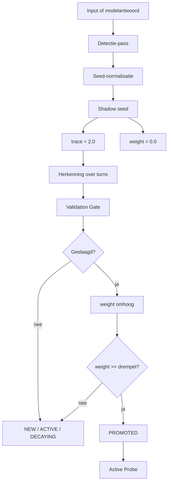

# Shadow Seed Learning 4.5

[](https://github.com/E-AI-MODEL/shadowseed/actions/workflows/tests.yml)


**Shadow Seed Learning (SSL) 4.5** is een mechanisme om kleine structurele afwezigheden in antwoorden te detecteren, op te slaan als gewichtloze seeds en pas na validatie te gebruiken voor vervolgvragen, retrieval of falsificatie.

> Een seed bevat precies één gap.

## Installatie

```bash
pip install -e ".[test]"
```

Optioneel met embeddingmodel:

```bash
pip install -e ".[test,models]"
```

## Snel starten

```bash
pytest
shadowseed run-gap-suite
shadowseed run-nlp-smoke
```

## CLI

```bash
shadowseed run-gap-suite
shadowseed run-nlp-smoke
shadowseed fetch-absencebench --limit 10
shadowseed run-local-absencebench --input examples/local_absencebench_sample.json
shadowseed prepare-absencebench
```

## Wat wordt getest?

| Laag | Doel | Commando | CI |
|---|---|---|---|
| Unit tests | codecorrectheid | `pytest` | ja |
| SSL 4.5 Gap-Test Suite | paper-pipeline | `shadowseed run-gap-suite` | ja |
| NLP / AbsenceBench smoke | regressiecheck | `shadowseed run-nlp-smoke` | ja |

## Architectuur



## Belangrijke bestanden

```text
src/shadowseed/manager.py                         # SSLManager: trace, weight, Validation Gate
src/shadowseed/data/gap_test_suite_4_5.json       # canonieke SSL 4.5 Gap-Test Suite
src/shadowseed/benchmark/ssl45_gap_suite.py       # evaluator voor de paper-test
src/shadowseed/prompt_templates.py                # promptbibliotheek
docs/01_framework.md                              # technische uitleg
docs/EXPERIMENT.md                                # experimentopzet
experiments/run_full.py                           # reproduceerbare run helper
```

## Huidige onderzoeksstatus

De repo is een research prototype. De huidige gratis evaluator vindt stabiel atomische gaps in scenario A en C, maar scenario B faalt nog en `promoted_hits` blijft 0. Dat betekent: detectie en scoring werken reproduceerbaar, maar het promotie-effect van de Validation Gate is nog niet overtuigend aangetoond.

## Wat dit niet claimt

- geen nieuw foundation model
- geen aanpassing van modelgewichten
- geen claim dat SSL state-of-the-art is
- geen bewezen promotie-effect in de huidige evaluator
- geen verplichte LLM- of GPU-run

## Documentatie

Lees verder in:

- `docs/01_framework.md`
- `docs/EXPERIMENT.md`

## Citeren

```text
Visser, H. (2026). Shadow Seed Learning 4.5: Atomische detectie en epistemische navigatie.
E-AI-MODEL/shadowseed.
```
