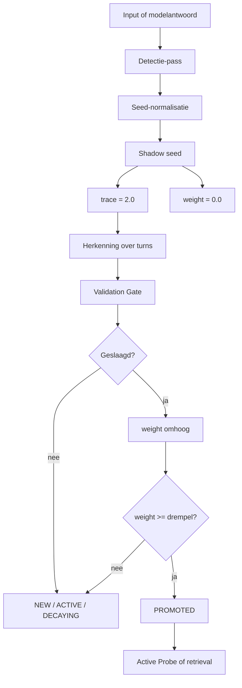
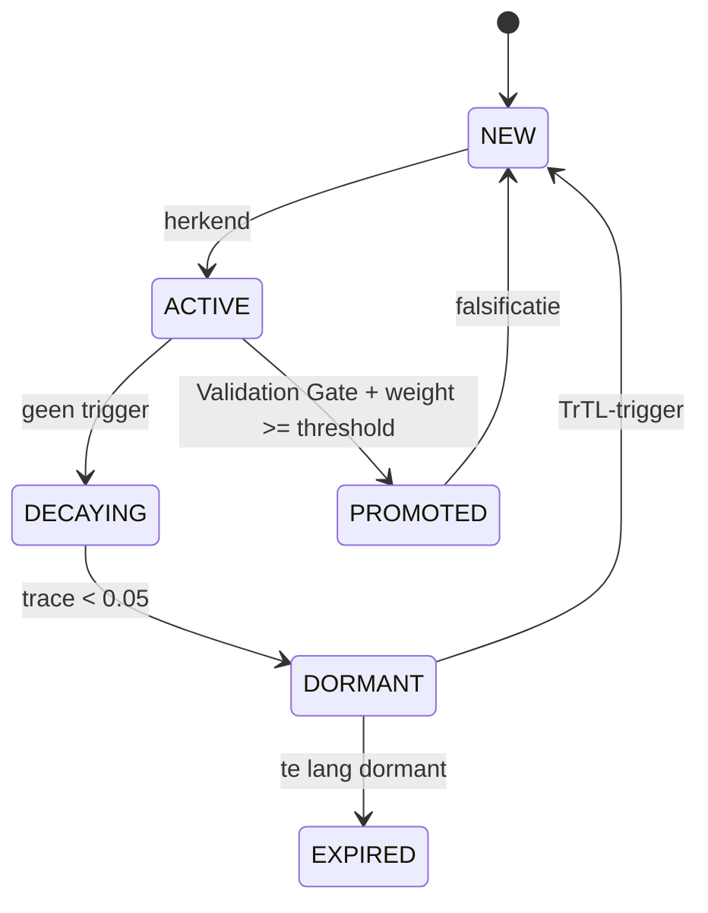
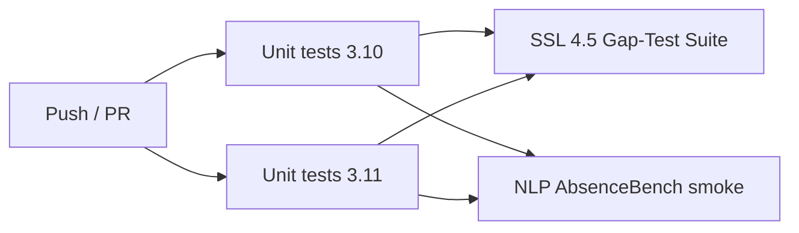

# Shadow Seed Learning 4.5

[](https://github.com/E-AI-MODEL/shadowseed/actions/workflows/tests.yml)


**Shadow Seed Learning (SSL) 4.5** is een mechanisme voor het detecteren, opslaan en valideren van kleine structurele afwezigheden in een antwoord.

De kern:

> Een seed bevat precies één gap.

Deze repository bevat de implementatie, de officiële SSL 4.5 Gap-Test Suite en een lichte NLP-smoke test. Alles draait gratis in GitHub Actions, zonder betaalde API's en zonder verplichte modeldownload.

---

## Wat wordt getest?

Deze repo test twee dingen:

| Laag | Doel | Commando | CI |
|---|---|---|---|
| Unit tests | Klopt de code? | `pytest` | ja |
| SSL 4.5 Gap-Test Suite | Klopt de paper-pipeline? | `shadowseed run-gap-suite` | ja |
| NLP / AbsenceBench smoke | Breekt de absence-runner niet? | `shadowseed run-nlp-smoke` | ja |

De Gap-Test Suite is de belangrijkste test. Die gebruikt drie scenario's met atomische ground-truth seeds en score 0/1/2.

---

## Architectuur



---

## Twee velden: trace en weight



| Veld | Betekenis | Startwaarde | Rol |
|---|---|---:|---|
| `trace` | aanwezigheid van de seed | `2.0` | geheugensterkte |
| `weight` | invloed van de seed | `0.0` | pas na validatie actief |

Belangrijk: een nieuwe seed is aanwezig, maar heeft nog geen invloed.

---

## Installatie

```bash
pip install -e ".[test]"
```

Optioneel met embeddingmodel:

```bash
pip install -e ".[test,models]"
```

---

## Quickstart

Run alles lokaal:

```bash
pytest
shadowseed run-gap-suite
shadowseed run-nlp-smoke
```

Run een kleine AbsenceBench-sample:

```bash
shadowseed fetch-absencebench --limit 10
shadowseed run-local-absencebench --input data/absencebench_sample.json
```

---

## CLI

```bash
shadowseed run-gap-suite
shadowseed run-nlp-smoke
shadowseed fetch-absencebench --limit 10
shadowseed run-local-absencebench --input examples/local_absencebench_sample.json
shadowseed prepare-absencebench
```

---

## CI

GitHub Actions draait op elke push en pull request:



De CI gebruikt geen betaalde API's en downloadt standaard geen groot model.

---

## Evaluatie

De SSL 4.5 Gap-Test Suite gebruikt de score uit de specificatie:

| Score | Betekenis |
|---:|---|
| 0 | geen relevante gap gevonden |
| 1 | richting klopt, maar output is te vaag of te breed |
| 2 | atomische en structureel juiste gap gevonden |

Ground truth wordt niet gebruikt tijdens detectie. Ground truth wordt alleen gebruikt voor evaluatie en externe validatie in de Validation Gate.

---

## Belangrijke bestanden

```text
src/shadowseed/manager.py                         # SSLManager: trace, weight, Validation Gate
src/shadowseed/data/gap_test_suite_4_5.json       # officiële SSL 4.5 Gap-Test Suite
src/shadowseed/benchmark/ssl45_gap_suite.py       # evaluator voor de paper-test
src/shadowseed/benchmark/absencebench_local.py    # lichte NLP smoke runner
src/shadowseed/benchmark/absencebench_hf.py       # gratis Hugging Face sample fetcher
src/shadowseed/cli.py                             # CLI entrypoint
docs/EXPERIMENT.md                                # experimentopzet
experiments/run_full.py                           # reproduceerbare run helper
```

---

## Wat dit wel en niet claimt

Wel:

- reproduceerbare SSL 4.5 testopzet
- multi-turn seed-opbouw
- Validation Gate
- scorebare Gap-Test Suite
- gratis CI-run

Niet:

- geen nieuw foundation model
- geen aanpassing van modelgewichten
- geen claim dat SSL al state-of-the-art is
- geen verplichte LLM- of GPU-run

---

## Status

- `main` is de leidende branch
- CI is groen
- SSL 4.5 Gap-Test Suite draait via CI
- NLP smoke test draait via CI

---

## Citeren

Gebruik deze repo als implementatie- en evaluatiebasis voor Shadow Seed Learning 4.5.

```text
Visser, H. (2026). Shadow Seed Learning 4.5: Atomische detectie en epistemische navigatie.
E-AI-MODEL/shadowseed.
```
