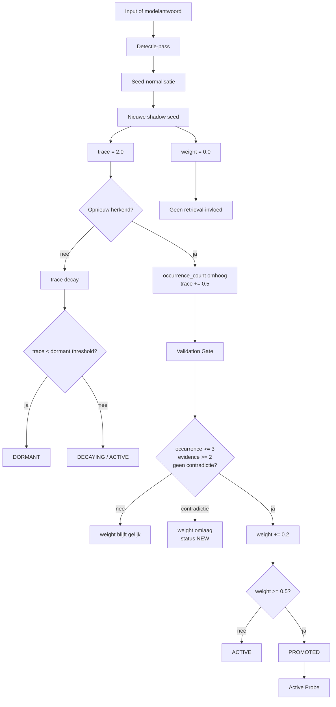

# Shadow Seed Learning 4.5

[](https://github.com/E-AI-MODEL/shadowseed/actions/workflows/tests.yml)


**Shadow Seed Learning (SSL) 4.5** is een mechanisme om kleine structurele afwezigheden in antwoorden te detecteren, op te slaan als gewichtloze seeds en pas na validatie te gebruiken voor vervolgvragen, retrieval of falsificatie.

> Een seed bevat precies één gap.

## Installatie

```bash
pip install -e ".[test]"
```

Optioneel met embeddingmodel:

```bash
pip install -e ".[test,models]"
```

## Snel starten

```bash
pytest
shadowseed run-gap-suite
shadowseed run-nlp-smoke
```

## CLI

```bash
shadowseed run-gap-suite
shadowseed run-nlp-smoke
shadowseed fetch-absencebench --limit 10
shadowseed run-local-absencebench --input examples/local_absencebench_sample.json
shadowseed prepare-absencebench
```

## Wat wordt getest?

| Laag | Doel | Commando | CI |
|---|---|---|---|
| Unit tests | codecorrectheid | `pytest` | ja |
| SSL 4.5 Gap-Test Suite | paper-pipeline | `shadowseed run-gap-suite` | ja |
| NLP / AbsenceBench smoke | regressiecheck | `shadowseed run-nlp-smoke` | ja |

## Architectuur



Belangrijk: `trace` en `weight` zijn gescheiden. Een seed kan sterk aanwezig zijn (`trace > 0`) en toch niets sturen (`weight = 0.0`).

## Formules in de implementatie

De kernformules uit SSL 4.5 zitten in `src/shadowseed/manager.py`.

| Mechanisme | Formule / regel | Python |
|---|---|---|
| Trace-start | `trace = 2.0` | `ShadowSeed.trace` |
| Weight-start | `weight = 0.0` | `ShadowSeed.weight` |
| Trace decay | `trace_t = trace_0 * exp(-t / half_life)` | `decay_traces()` |
| Herkenning | `trace = min(trace + 0.5, max_trace)` | `add_or_update_seed()` |
| TrTL-reactivatie | `trace = min(trace + 2.0, max_trace)` | `reactivate_by_text()` |
| Deduplicatie | `cosine_similarity >= 0.85` | `np.dot(new_emb, seed.embedding)` |
| Gate check 1 | `occurrence_count >= 3 and trace > 0.5` | `run_validation_gate()` |
| Gate check 2 | `evidence_count >= 2` | `run_validation_gate()` |
| Gate check 3 | `not contradiction` | `run_validation_gate()` |
| Weight omhoog | `weight = min(1.0, weight + 0.2)` | `run_validation_gate()` |
| Falsificatie | `weight = max(0.0, weight - 0.3)` | `run_validation_gate()` |
| Promotie | `weight >= 0.5` | `SeedStatus.PROMOTED` |

## Belangrijke bestanden

```text
src/shadowseed/manager.py                         # SSLManager: trace, weight, Validation Gate
src/shadowseed/data/gap_test_suite_4_5.json       # canonieke SSL 4.5 Gap-Test Suite
src/shadowseed/benchmark/ssl45_gap_suite.py       # evaluator voor de paper-test
src/shadowseed/prompt_templates.py                # promptbibliotheek
docs/01_framework.md                              # technische uitleg
docs/README.md                                    # documentatie-index
docs/EXPERIMENT.md                                # experimentopzet
experiments/run_full.py                           # reproduceerbare run helper
```

## Huidige onderzoeksstatus

De repo is een research prototype. De huidige gratis evaluator vindt stabiel atomische gaps in scenario A en C, maar scenario B faalt nog en `promoted_hits` blijft 0. Dat betekent: detectie en scoring werken reproduceerbaar, maar het promotie-effect van de Validation Gate is nog niet overtuigend aangetoond.

## Wat dit niet claimt

- geen nieuw foundation model
- geen aanpassing van modelgewichten
- geen claim dat SSL state-of-the-art is
- geen bewezen promotie-effect in de huidige evaluator
- geen verplichte LLM- of GPU-run

## Documentatie

Lees verder in:

- `docs/README.md`
- `docs/01_framework.md`
- `docs/02_atomic_seeds.md`
- `docs/03_gap_test_suite.md`
- `docs/04_testplan_fase_0_4.md`
- `docs/EXPERIMENT.md`

## Citeren

```text
Visser, H. (2026). Shadow Seed Learning 4.5: Atomische detectie en epistemische navigatie.
E-AI-MODEL/shadowseed.
```
